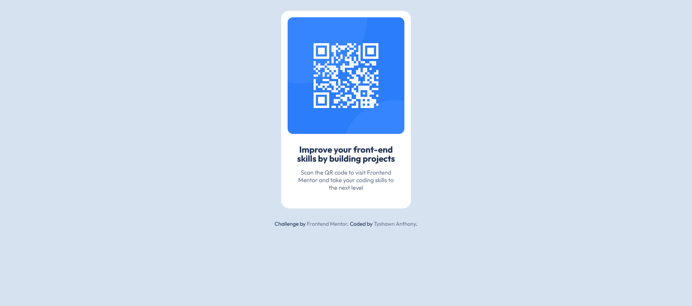

# Frontend Mentor - QR code component solution

This is a solution to the [QR code component challenge on Frontend Mentor](https://www.frontendmentor.io/challenges/qr-code-component-iux_sIO_H). Frontend Mentor challenges help you improve your coding skills by building realistic projects.

## Table of contents

- [Overview](#overview)
  - [Screenshot](#screenshot)
  - [Links](#links)
- [My process](#my-process)
  - [Built with](#built-with)
  - [What I learned](#what-i-learned)
  - [Continued development](#continued-development)
- [Author](#author)

## Overview

### Screenshot

### Links

- Solution URL: https://www.frontendmentor.io/solutions/qr-code-component-using-flexbox-PZY_eiU36X
- Solution URL: (https://www.frontendmentor.io/solutions/qr-code-component-using-flexbox-PZY_eiU36X)
- Solution URL: [https://www.frontendmentor.io/solutions/qr-code-component-using-flexbox-PZY_eiU36X](https://www.frontendmentor.io/solutions/qr-code-component-using-flexbox-PZY_eiU36X)
- Live Site URL: [https://qr-code-component-challenge-tyshawn-anthonys-projects.vercel.app/]

## My process

### Built with

- HTML5
- CSS
- Flexbox

### What I learned

- This is my first project after a year or two break.
- I learned I should be focusing more on Mobile-first development, which I didn't implement here very well. I don't actually think it needs it here, but not having it at least be a thought is something I should work on.

### Continued development

- On continuing development, I'd like to be able to use better practices, and also learn the workflow of Github going forward.

## Author

- Frontend Mentor (https://www.frontendmentor.io/profile/tyshawn-anthony)
